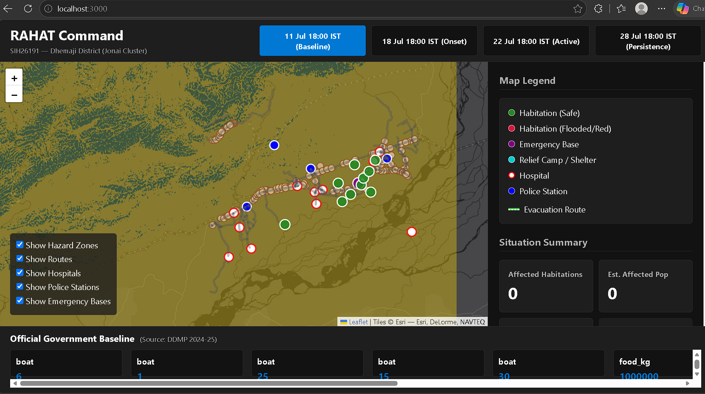
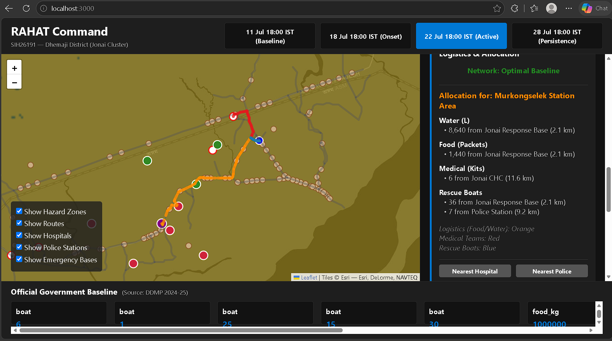
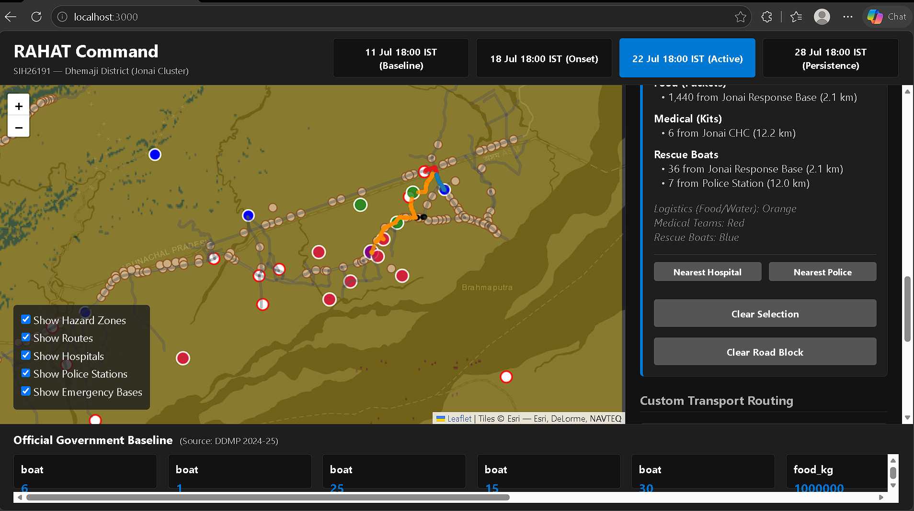
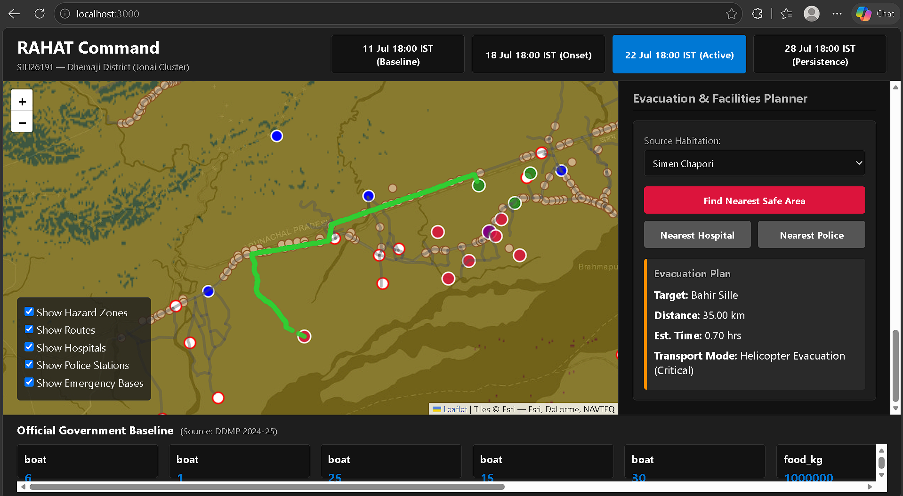
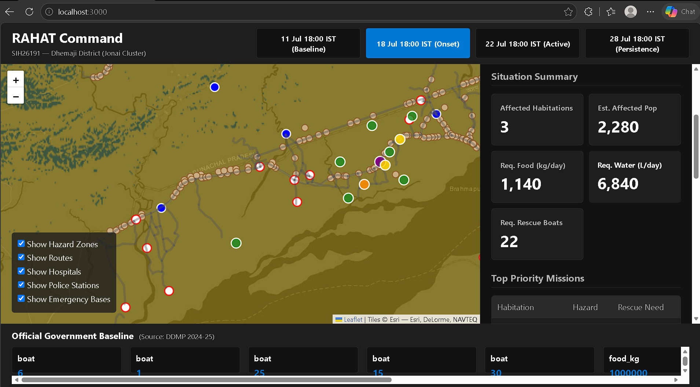
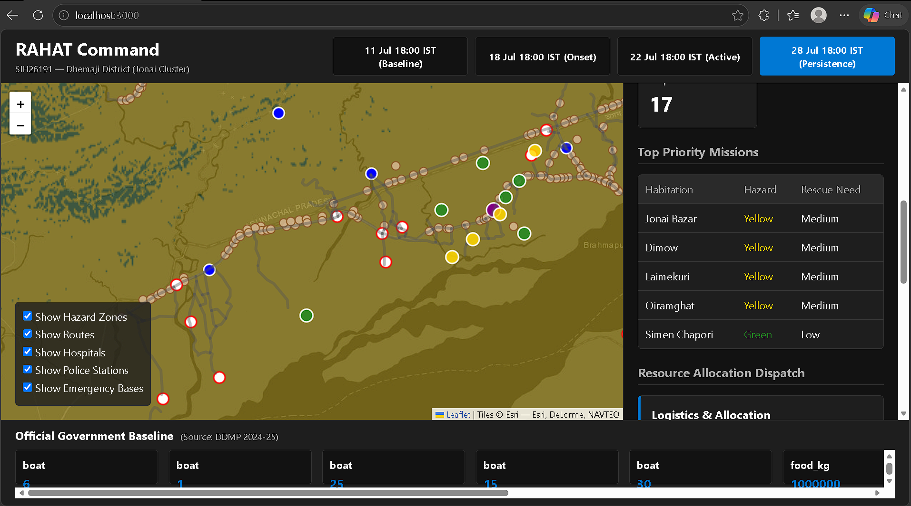
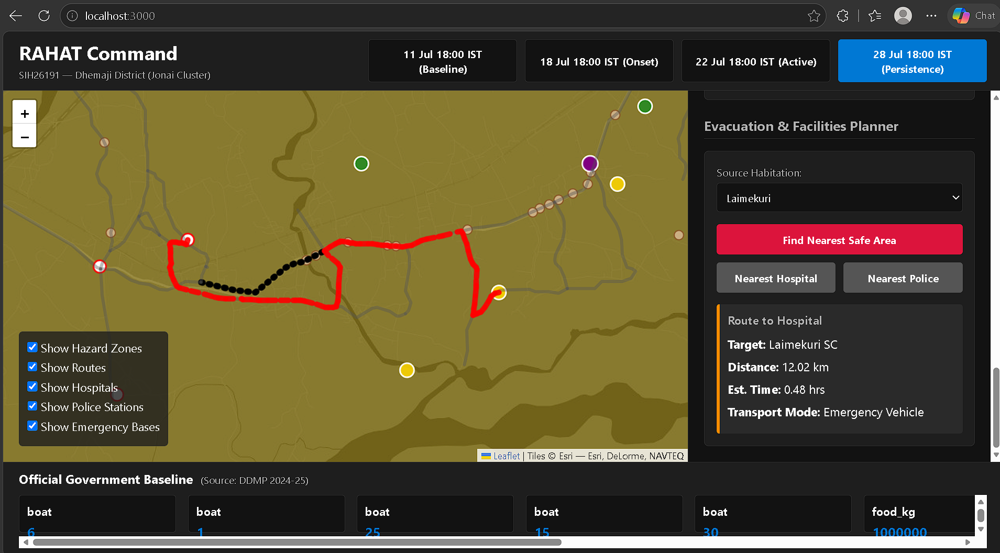

# RAHAT — SIH26191 Prototype

**Flood Hazard-Based Red-Zone Identification & Emergency Response Optimization System**
Built for the Smart India Hackathon (SIH26191 — Ministry of Home Affairs).

## Overview
The **RAHAT Command System** is an operational and analytical tool designed to convert raw Sentinel-1 satellite observations into explainable emergency response plans. Developed with a rigorous focus on geospatial analysis and algorithmic optimization, this system acts as a high-performance command dashboard for disaster management. It identifies flood hazard red zones, assesses vulnerable habitations, and optimizes rescue and relief routing using official government resource baselines.

The detailed demonstration cluster is **Jonai–Murkongselek, Dhemaji District, Assam**.

## Academic & Technical Merit
This project heavily emphasizes advanced geospatial analysis and optimization algorithms, focusing on robust back-end engineering:
- **Geospatial Processing:** Extracts binary flood masks from temporal Sentinel-1 SAR observations and derives physical gradients (slope) from Copernicus 30m DEM (COP30).
- **Hazard Scoring Engine:** Computes a transparent, weighted Red-Zone map based on flood presence, low elevation, and flat slopes to objectively prioritize vulnerable regions.
- **Logistical Graph Optimization:** Solves a complex network graph using Dijkstra's algorithm to calculate optimal routes for medical teams, rescue boats, and food supplies, while simulating real-time road-closure disruptions.
- **Data-Driven Allocation:** Intersects affected habitations with hazard maps to mathematically calculate exact relief needs based on the District Disaster Management Plan (DDMP).
- **Visualization Layer:** A streamlined, interactive TypeScript/Leaflet interface built to ingest pre-computed hazard data and georeferenced route vectors for immediate operational review.

## Dashboard Features & Visualizations
The system features a decoupled, interactive visualization layer providing comprehensive insights into flood hazards and evacuation logistics:

- **Official Government Baseline Overview**: Provides a complete situational awareness map displaying all relief camps, emergency bases, hospitals, and police stations across the affected terrain.
  

- **Logistics Allocation for Murkongselek Station Area**: Demonstrates the algorithmic resource distribution, calculating precise paths for water, food, medical kits, and rescue boats from various safe bases to a targeted hazard zone.
  

- **Custom Transport Routing**: Shows the engine mapping dynamic transport routes around flood-blocked road networks to ensure continuous supply chain operations.
  

- **Evacuation Plan Target**: Highlights the shortest safe path for evacuating civilians from a flooded habitation to a safe zone using calculated helicopter or emergency vehicle parameters.
  

- **Situation Summary**: A dynamic dashboard panel summarizing total affected habitations, estimated displaced populations, and required daily rations based on automated hazard intersection.
  

- **Medical Evacuation Route (Hospital)**: Demonstrates targeted routing to the nearest active, non-flooded medical facility for critical care transport.
  

- **Security/Rescue Route (Police Station)**: Showcases optimal pathfinding to the nearest active police station for security or emergency rescue coordination.
  

## Directory Architecture

```text
RAHAT/
├── src/
│   ├── flood/                  # SAR change-detection methodology and binary mask extraction
│   ├── terrain/                # Topographical processing deriving slope/elevation from COP30 DEM
│   ├── hazard/                 # Weighted-overlay logic to compute Red/Orange/Yellow/Green zones
│   ├── habitation/             # Intersects demographic data with the hazard map to find exposure
│   ├── needs/                  # Calculates relief material requirements based on affected population
│   ├── routing/                # Network topology builder mapping roads and facilities to a graph
│   ├── optimization/           # Dijkstra's algorithm solver for resource allocation and evacuation
│   └── dashboard/              # Pure HTML/CSS/TypeScript frontend visualization dashboard
├── public/
│   ├── data/                   # Pre-computed graph topologies and situational state JSONs
│   └── overlays/               # Processed raster map overlays (hazard maps, flood vectors)
├── docs/                       # Exhaustive explanations of methodology, code, and theoretical concepts
└── README.md                   
```

## Data Sources
- **Observed:** Sentinel-1 SAR (July 2026 Dhemaji event)
- **Observed:** Copernicus 30m DEM (COP30)
- **Official Government Baseline:** DDMP Dhemaji 2024-25 (Shelters, SDRF, Resources)
- **Derived:** Hazard Maps, Flood Masks, Route Graphs

## Installation and Execution

### Requirements
- Python 3.10+
- `rasterio`, `numpy`, `pillow` (for backend processing)
- Node.js & npm (for frontend dashboard)

### 1. Run Data Pipeline
If you wish to re-generate the data from the raw datasets:
```bash
python src/flood/process_flood.py
python src/terrain/process_dem.py
python src/hazard/score_hazard.py
python src/habitation/assess_exposure.py
python src/needs/prioritize.py
python src/resources/prepare_baseline.py
python src/routing/build_graph.py
python src/optimization/solver.py
python src/dashboard/export_overlays.py
```

### 2. Run the Dashboard
```bash
npm install
npm run dev
```
Open `http://localhost:3000` in your browser.

## Known Limitations
- The 28 July SAR dataset was corrupted in the source and is handled gracefully as a fallback in the UI.
- The routing network uses a synthetic simplified topology for the prototype to avoid complex WKB parsing of the 2.5 million row GeoParquet without heavy GIS libraries.
- The population values for the specific representative coordinates are scenario approximations for demonstration purposes.
