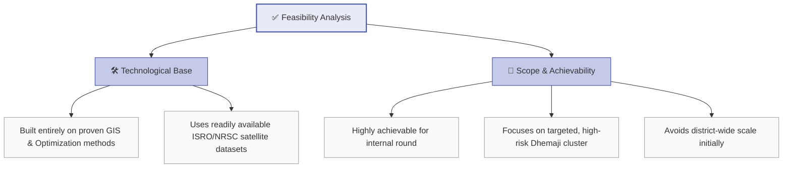
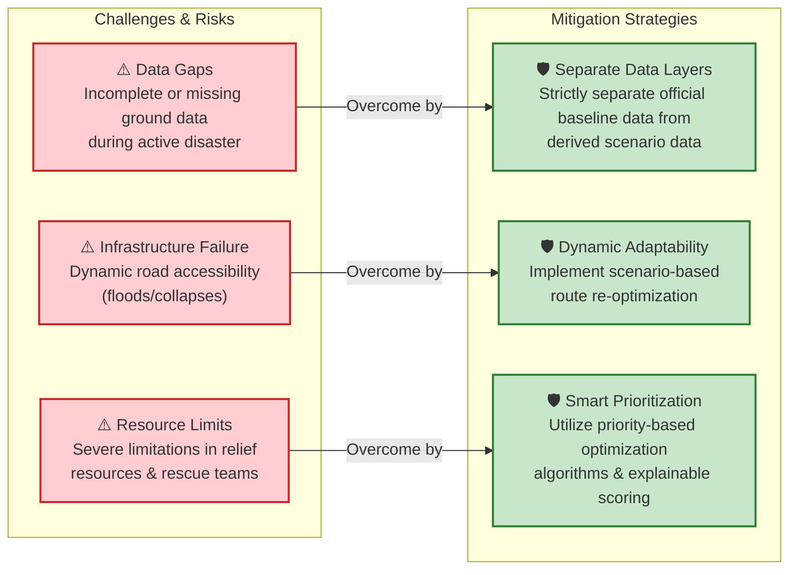
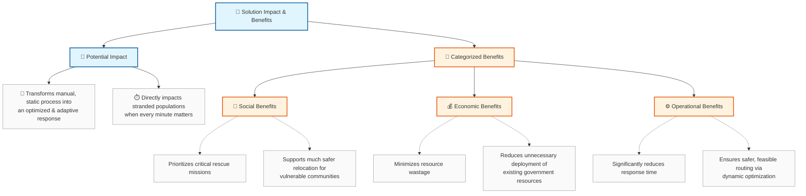

# Smart India Hackathon 2026 - Presentation Visuals

This document contains visual representations (diagrams and flowcharts) of the provided presentation slides. 

## 1. Feasibility Analysis

This diagram illustrates the technical and scope-related feasibility of the idea.

## 2. Challenges and Mitigation Strategies

This flowchart maps the potential risks during an active disaster to the specific strategies implemented to overcome them.

## 3. Impact and Benefits

This breakdown highlights the overarching impact on the target audience and categorizes the specific benefits of the solution.

